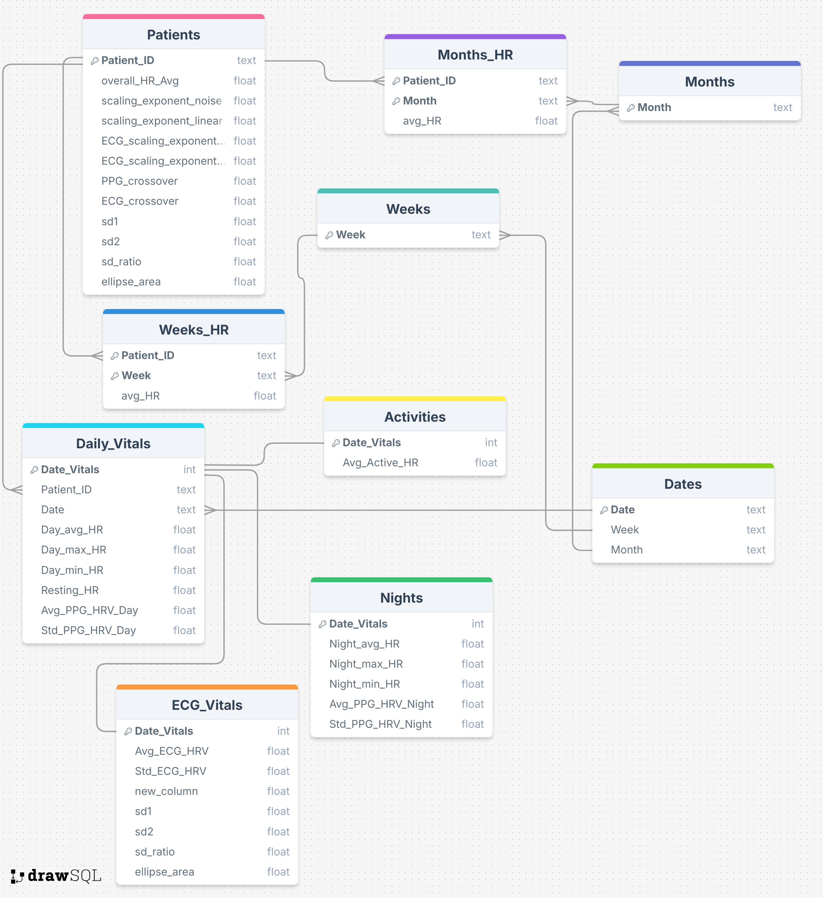

# SmartWatch Metrics Pipeline

This pipeline takes in paths to folders containing the data from **Withings Scanwatch** watches, with no preprocessing of the data required. The PPG Heart Rate data is then processed, and the ECG signals are processed using a seperate file. All metrics are then added to a SQL Database to be easily accessed for analysis. Graphs for different metrics can be toggled on or off.

## Setting Up

Download and unzip the user data from the smartwatches, either via the app or the website.  
Main Pipeline is within the **raw_hr_analysis.py** file 
Update ***patient_data_path*** with the path to the folder and ***volunteer_data_path*** if relevent. 
Update ***sys.path*** statement at beginning of code to the location of the ***patient_analysis3*** python script for ECG analysis. 
Update ***saving_path*** with the location you wish to save the plots generated to. 

### Required Packages

[numpy](https://pypi.org/project/numpy/) 
[matplotlib.pyplot](https://pypi.org/project/matplotlib/) 
[pandas](https://pypi.org/project/pandas/) 
[pathlib](https://pypi.org/project/pathlib/) 
[scipy](https://pypi.org/project/scipy/) 
[datetime](https://docs.python.org/3/library/datetime.html) 
[sqlite3](https://docs.python.org/3/library/sqlite3.html) 
[sys](https://docs.python.org/3/library/sys.html) 
[traceback](https://docs.python.org/3/library/traceback.html) 
[collections](https://docs.python.org/3/library/collections.html) 
[statsmodels.api](https://pypi.org/project/statsmodels/) 
[pyhrv.nonlinear](https://pypi.org/project/pyhrv/) 
[csv](https://docs.python.org/3/library/csv.html) 
[warnings](https://docs.python.org/3/library/warnings.html) 

## Using The Pipeline

This pipeline requires ECG analysis from ***patient_analysis3.py*** 
The code runs from the ***main()*** function, but is modular and can be used in parts with minimal preprocessing - ECG analysis requires more preprocessing but is easily seen in the afformentioned function. 
***Flags*** is an instance of the named tuple ***flags*** which is used to control when plots should be created. It is changed by ammending the Bools in the instantiation at the beginning of ***main***. Most functions have a Flags default but check the docstrings to avoid errors when using in a modular form.  

### Database
The Database created from all the determined metrics is by default created in the same folder as the pipeline script. This can be changed simply by adding the path into the line defining the database: ***db_name = 'patient_metrics.db' if Flag else 'volunteer_metrics.db'*** on line **946**. 
The Database is a Relational Database normalised to 3NF, and the database diagram is seen bellow:

# DFA analysis

The DFA analysis uses R squared linear regression to fit 2 straight lines to the data,finding the point where the two lines produce the greatest weighted R squared. This method, whilst valid, is not necessarily the correct method, and it may in fact be better to define the crossover region either exactly or much more specifically than it currently i so this can be very simply changed in the function ***detecting_crossover***.
